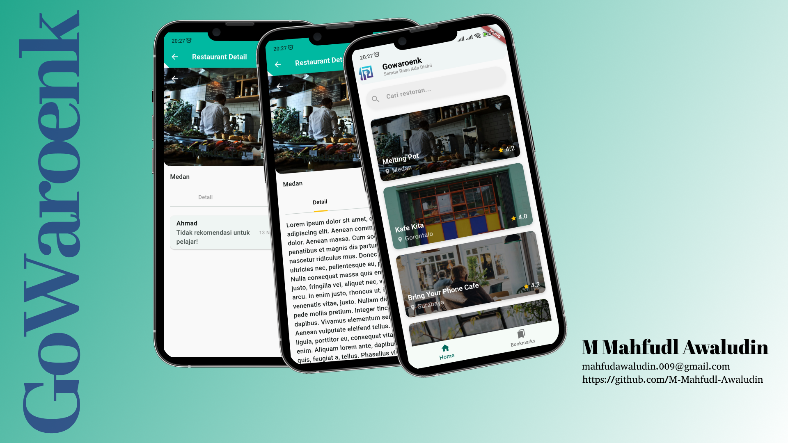

# BEKUP-CREATE-2025
**ini adalah repository project saya selama mengikuti program BEKUP CREATE 2025 Multi-Platform App dengan Flutter**

# 🍽️ GoWaroenk – BEKUP CREATE 2025  
**Repository Project: BEKUP CREATE 2025 Multi-Platform App with Flutter**

---

## 📱 Tentang Aplikasi  
**GoWaroenk** adalah aplikasi Flutter yang dikembangkan sebagai bagian dari program **BEKUP CREATE 2025**, dalam kelas *Multi-Platform App Development with Flutter*.  
Aplikasi ini berfokus pada penjelajahan kuliner Indonesia melalui daftar restoran yang ditampilkan secara dinamis dari API publik.  
Pengguna dapat melihat daftar restoran, menelusuri detail setiap restoran, hingga menikmati tampilan antarmuka yang elegan dengan tema terang dan gelap.  

Tema: **Restaurant Finder & Food Discovery App**

---

## 🎨 Mockup Desain  
Berikut tampilan rancangan antarmuka aplikasi **GoWaroenk** 👇  



# Submission: Proyek Awal - Restaurant App dengan API

Selamat datang di submission **Proyek Awal: Restaurant App dengan API** 🎉  
Pada submission ini, Anda akan membuat aplikasi Flutter yang menampilkan data restoran dari API.  
Submission ini merupakan bagian penting untuk melanjutkan ke **submission akhir**, jadi pastikan semua kriteria wajib terpenuhi.  

---

## 🎯 Kriteria Submission

### 1. Halaman Daftar Restoran
- Membuat **satu halaman** berisi daftar restoran.  
- Data restoran harus didapat dari **API**.  
- Informasi minimal yang ditampilkan pada setiap item:  
  - Nama restoran  
  - Gambar restoran  
  - Kota  
  - Rating  

### 2. Halaman Detail Restoran
- Membuat **satu halaman** berisi detail restoran.  
- Data detail restoran harus didapat dari **API**.  
- Informasi yang ditampilkan:  
  - Nama restoran  
  - Gambar restoran  
  - Deskripsi  
  - Kota  
  - Alamat  
  - Rating  
  - Menu makanan  
  - Menu minuman  

### 3. Mengganti Tema Default
- Menambahkan **tema terang (light)** dan **tema gelap (dark)**.  
- Mengubah default **font type** aplikasi.  
- Mengganti **warna tema** selain warna default bawaan Flutter.  

### 4. Indikator Loading
- Tampilkan indikator loading setiap kali melakukan pemanggilan API.  
- Indikator dapat berupa:  
  - `CircularProgressIndicator`  
  - Gambar animasi  
  - Animasi menggunakan **Lottie** atau **Rive**  

### 5. Menggunakan State Management
- Wajib menggunakan library **Provider**.  
- Cukup menggunakan **satu state management** untuk mengelola state aplikasi.  
- Gunakan **sealed class** (misalnya `Loading`, `HasData`, `NoData`, `Error`) untuk mengatur status pemanggilan API.  

---

## ✅ Syarat Kelulusan
- Semua kriteria di atas harus dipenuhi.  
- Aplikasi dapat dijalankan tanpa error.  
- Tampilan rapi dan bebas overflow.  
- Menggunakan state management **Provider** secara konsisten.  

---

## 🚀 Cara Menjalankan
1. Pastikan Flutter SDK sudah terinstall.  
2. Clone atau download repository ini.  
3. Jalankan perintah berikut:  

```bash
flutter pub get
flutter run
