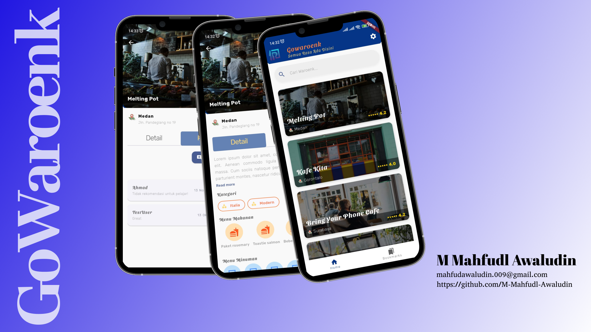

# BEKUP-CREATE-2025
**Ini adalah repository project saya selama mengikuti program BEKUP CREATE 2025 Multi-Platform App dengan Flutter.**

---

# 🍽️ Submission: Proyek Akhir - Favorite Restaurant App

Selamat datang di submission **Proyek Akhir: Favorite Restaurant App** 🎉  
Submission ini merupakan kelanjutan dari **Proyek Awal: Restaurant App dengan API** pada program **BEKUP CREATE 2025**.  
Aplikasi ini berfungsi sebagai media eksplorasi kuliner Indonesia yang memungkinkan pengguna untuk mencari, melihat detail, serta menyimpan restoran favorit secara lokal.  

---

## 📱 Tentang Aplikasi

**GoWaroenk** adalah aplikasi Flutter yang dikembangkan sebagai bagian dari proyek akhir BEKUP CREATE 2025 – Multi-Platform App Development.  
Aplikasi ini menampilkan daftar restoran dari API publik, dilengkapi dengan fitur favorit, pengaturan tema, dan pengingat harian (*daily reminder*).  

Fitur utama:
- 🔍 Menelusuri daftar restoran dari API publik.  
- 🍴 Melihat detail lengkap restoran (deskripsi, rating, menu, lokasi).  
- ❤️ Menyimpan restoran favorit ke database lokal (SQLite).  
- 🌗 Mengganti tema terang dan gelap sesuai preferensi pengguna.  
- ⏰ Menerima notifikasi pengingat makan siang setiap pukul 11.00 AM.  

Aplikasi ini juga menerapkan **Provider** sebagai state management dan menggunakan **SharedPreferences** untuk menyimpan pengaturan tema dan reminder.

---

## 🎨 Mockup Desain

Berikut adalah rancangan antarmuka aplikasi **GoWaroenk** 👇  


- **Halaman Daftar Restoran** – Menampilkan daftar restoran dari API.  
- **Halaman Detail Restoran** – Menampilkan informasi lengkap restoran.  
- **Halaman Favorit** – Berisi daftar restoran yang telah disimpan pengguna.  
- **Halaman Settings** – Mengatur tema dan fitur reminder harian.  

---

## 🎯 Kriteria Submission

### 1. Mempertahankan Kriteria Utama
- Semua kriteria dari submission sebelumnya (**Restaurant App dengan API**) harus tetap dipertahankan:
  - Menampilkan daftar restoran dari API.  
  - Menampilkan detail restoran.  
  - Menggunakan Provider sebagai state management.  
  - Menerapkan tema terang dan gelap.  
  - Menampilkan indikator loading saat pemanggilan data API.  

---

### 2. 🍴 Halaman Favorit Restoran
- Membuat **satu halaman khusus** berisi daftar restoran favorit.  
- Informasi minimal yang ditampilkan pada setiap item card:  
  - Nama restoran  
  - Gambar restoran  
  - Kota  
  - Rating  
- Apabila item favorit ditekan, aplikasi harus **berpindah ke halaman detail restoran**.  
- Pengguna dapat **menambahkan** dan **menghapus** restoran dari daftar favorit (baik dari halaman detail maupun daftar favorit).  
- Informasi daftar favorit harus disimpan di **SQLite Database**.  

---

### 3. 🌗 Pengaturan Tema
- Menambahkan menu untuk mengganti **tema terang (light)** dan **tema gelap (dark)**.  
- Simpan perubahan tema menggunakan **SharedPreferences**.  
- Tema harus tetap tersimpan walaupun aplikasi ditutup dan dibuka kembali.  
- Pastikan setiap komponen aplikasi tetap terbaca dengan baik pada kedua tema.  

---

### 4. ⏰ Fitur Daily Reminder
- Menambahkan pengaturan untuk **menghidupkan** dan **mematikan reminder** di halaman **Settings**.  
- Simpan pengaturan reminder menggunakan **SharedPreferences**.  
- Reminder harus menampilkan **notifikasi pada pukul 11.00 AM** dengan memanfaatkan **Scheduled Notification**.  
- Notifikasi berfungsi untuk mengingatkan pengguna mengenai makan siang.  

> 💡 *Bonus:* Reminder dapat menampilkan restoran acak dari API menggunakan **WorkManager** dan **Simple Notification**.

---

### 5. 🧪 Pengujian (Testing)
- Terapkan minimal **tiga skenario pengujian** pada fungsi di dalam **Provider** untuk mengambil daftar restoran.  
- Skenario yang harus diuji:  
  1. Memastikan **state awal provider** sudah terdefinisi.  
  2. Memastikan **daftar restoran berhasil dikembalikan** ketika pengambilan data API sukses.  
  3. Memastikan **kesalahan dikembalikan** ketika pengambilan data API gagal.  

> Untuk nilai tertinggi, buat minimal **5 test case** mencakup *unit test, widget test,* dan *integration test*.

---

## ✅ Syarat Kelulusan
- Semua kriteria di atas harus terpenuhi.  
- Aplikasi dapat dijalankan tanpa error dan tanpa overflow.  
- Tema dan reminder tersimpan dengan baik setelah aplikasi ditutup dan dibuka kembali.  
- Pengujian berjalan sukses sesuai deskripsi.  

---

## 🚀 Cara Menjalankan Aplikasi

1. Pastikan **Flutter SDK** sudah terinstal.  
2. Clone repository ini:  
   ```bash
   git clone https://github.com/username/gowaroenk.git
