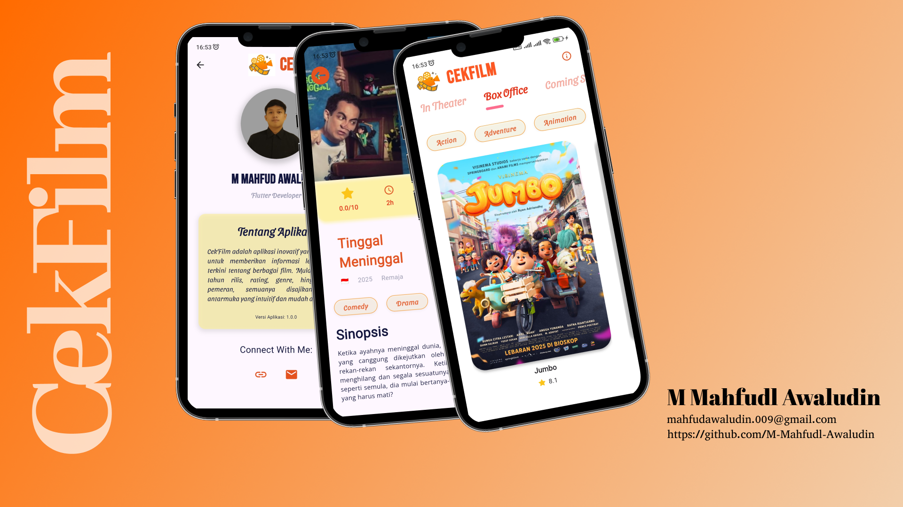

# BEKUP-CREATE-2025
**ini adalah repository project saya selama mengikuti program BEKUP CREATE 2025 Multi-Platform App dengan Flutter**

# 🎬 CekFilm – BEKUP CREATE 2025  
**Repository Project: BEKUP CREATE 2025 Multi-Platform App with Flutter**  

---

## 📱 Tentang Aplikasi  
**CekFilm** adalah aplikasi Flutter sederhana yang dikembangkan sebagai bagian dari program **BEKUP CREATE 2025**, khususnya pada kelas *Belajar Membuat Aplikasi Flutter untuk Pemula*.  
Aplikasi ini dirancang untuk membantu pengguna **mengecek daftar film, rating, dan detail film terbaru** dengan antarmuka yang interaktif dan mudah digunakan.  

Tema yang diusung: **Digital Entertainment & Movie Discovery**  
Proyek ini menjadi latihan dasar dalam membangun aplikasi lintas platform menggunakan Flutter dengan penerapan widget dasar, navigasi, serta layout responsif.  

---

## 🧩 Fitur Utama  
- Menampilkan daftar film (Stateless Widget)  
- Halaman detail film dengan sinopsis dan rating (Stateful Widget)  
- Navigasi antar halaman menggunakan `Navigator.push()`  
- Layout responsif tanpa overflow  
- Desain sederhana namun modern  

---

## 🎨 Mockup Desain  
Berikut tampilan rancangan antarmuka aplikasi **CekFilm** 👇  

  

# Belajar Membuat Aplikasi Flutter untuk Pemula

Selamat datang di submission kelas **Belajar Membuat Aplikasi Flutter untuk Pemula** 🎉  
Pada submission ini, Anda diminta untuk membuat aplikasi Flutter sederhana dengan kriteria yang sudah ditentukan.  
Tema aplikasi **bebas**, namun semakin detail dan lengkap aplikasi yang dibuat maka nilai submission bisa lebih tinggi.  

---

## 🎯 Kriteria Submission

### 1. Stateless Widget
- Aplikasi harus menggunakan **Stateless Widget**.  
- Contoh: menampilkan layout menggunakan `Row`, `Column`, atau `Container`.

### 2. Stateful Widget
- Aplikasi harus menggunakan **Stateful Widget**.  
- Contoh: menerima input dari pengguna (`TextField`), menampilkan status aplikasi (`Counter`, `Switch`, `Checkbox`, dll).

### 3. Navigation
- Aplikasi harus memiliki minimal **2 (dua) halaman**.  
- Terapkan navigasi antar halaman menggunakan `Navigator.push()` atau `Navigator.pushNamed()`.

### 4. Layout Responsif
- Tampilan aplikasi **tidak boleh overflow**.  
- Tampilan harus menyesuaikan ukuran layar.  
- Poin plus: tampilan responsif di perangkat mobile **dan** browser (Flutter Web).

### 5. Kreativitas & Kelengkapan
- Tema aplikasi bebas.  
- Semakin detail dan lengkap fitur/tampilan aplikasi Anda, maka nilai submission akan lebih tinggi.  

---

## ✅ Syarat Kelulusan
- Aplikasi harus memenuhi **semua kriteria di atas**.  
- Aplikasi **dapat dijalankan tanpa error**.  
- Tidak ada tampilan yang mengalami overflow.  
- Navigasi antar halaman dapat berjalan dengan baik.  

---

## 🚀 Cara Menjalankan
1. Pastikan Flutter SDK sudah terinstall.  
2. Clone atau download repository ini.  
3. Jalankan perintah berikut pada terminal:  

```bash
flutter pub get
flutter run
