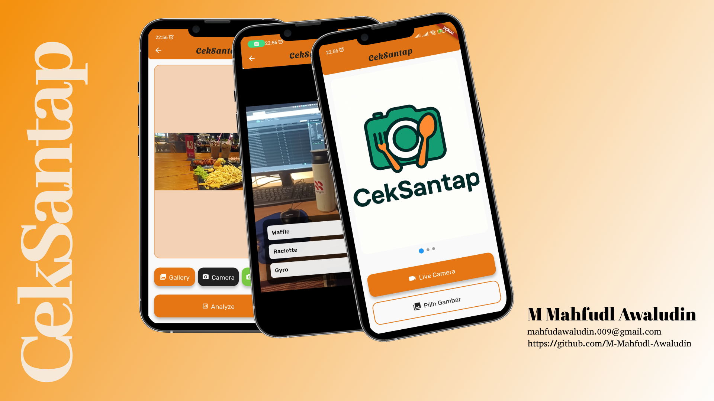

# 🍽️ CekSantap – BEKUP CREATE 2025  
**Repository Project:** BEKUP CREATE 2025 Multi-Platform App with Flutter  

---

## 📱 Tentang Aplikasi  
**CekSantap** adalah aplikasi **Food Recognizer App** berbasis Flutter yang dikembangkan sebagai bagian dari program **BEKUP CREATE 2025**.  
Aplikasi ini memanfaatkan **machine learning model (TensorFlow Lite)** untuk mengenali jenis makanan dari gambar yang diambil pengguna melalui **kamera** atau **galeri**.  
Setelah gambar dianalisis, aplikasi akan menampilkan hasil prediksi disertai informasi lengkap tentang makanan tersebut yang diambil dari **MealDB API** dan **Gemini API**.  

**Tema:** Food Recognition & Nutrition Insight App 🍔📸  

---

## 🎨 Mockup Desain  

Berikut tampilan rancangan antarmuka aplikasi **CekSantap** 👇  



---

## 🎯 Kriteria Submission  

### **Kriteria 1: Penerapan Fitur Pengambilan Gambar**  
Aplikasi CekSantap menyediakan fitur lengkap untuk mengambil gambar dari **kamera** maupun **galeri**.

**Kompetensi yang dicapai:**  
- Implementasi `image_picker` untuk mengambil gambar dari galeri/kamera.  
- Implementasi `camera` untuk **custom live camera**.  
- Penambahan fitur crop menggunakan `image_cropper`.  
- Identifikasi makanan dapat dilakukan **secara real-time** melalui camera stream.

**Hasil Penilaian:**  
✅ **Advanced (4 pts)** — seluruh fitur pengambilan gambar berfungsi dengan baik tanpa crash, termasuk crop dan real-time detection.  

---

### **Kriteria 2: Penerapan Fitur Machine Learning**  
Aplikasi mengintegrasikan model **TensorFlow Lite (TFLite)** untuk mengenali makanan dari gambar yang diambil.  
Proses inferensi dilakukan di background thread agar UI tetap responsif.

**Kompetensi yang dicapai:**  
- Integrasi **TFLite** untuk image classification.  
- Inferensi dijalankan di **Isolate** (background thread).  
- Alternatif dukungan untuk **Firebase ML**.  

**Hasil Penilaian:**  
✅ **Advanced (4 pts)** — model machine learning berjalan mulus tanpa freeze, dan dapat diperluas ke Firebase ML.  

---

### **Kriteria 3: Menyediakan Halaman Prediksi**  
Setelah proses deteksi selesai, aplikasi menampilkan halaman hasil prediksi yang informatif dan menarik.

**Informasi yang ditampilkan:**  
- 📸 Gambar hasil tangkapan pengguna  
- 🍱 Nama makanan hasil prediksi ML  
- 📊 Confidence score (%)  
- 📖 Detail resep dari **MealDB API**:  
  - Nama makanan  
  - Gambar  
  - Daftar bahan & takaran  
  - Langkah-langkah pembuatan  
- 🧠 Informasi nutrisi dari **Gemini API**:  
  - Kalori  
  - Karbohidrat  
  - Lemak  
  - Serat  
  - Protein  

**Hasil Penilaian:**  
✅ **Advanced (4 pts)** — halaman prediksi interaktif, informatif, dan menampilkan data dari dua API eksternal.  

---

## ✅ **Syarat Kelulusan**
Semua kriteria telah terpenuhi dengan hasil penilaian **Advanced (4 pts)** untuk setiap aspek.  
Aplikasi **berjalan stabil**, **tidak ada error/crash**, dan **informasi tampil jelas dan rapi**.  

---

## ⚙️ **Fitur Utama**
- 📷 Ambil gambar dari kamera atau galeri  
- ✂️ Crop gambar sebelum analisis  
- 🤖 Prediksi jenis makanan dengan TensorFlow Lite  
- 🌐 Ambil informasi resep dari MealDB API  
- 🧬 Dapatkan detail nutrisi dari Gemini API  
- 🌓 Tampilan UI bersih dan mudah digunakan  

---

## 🧩 **Teknologi yang Digunakan**
- **Flutter SDK**  
- **Dart**  
- **TensorFlow Lite (TFLite)**  
- **Image Picker & Camera Plugin**  
- **Image Cropper**  
- **MealDB API**  
- **Gemini API**  
- **Provider (State Management)**  

---

## 🚀 **Cara Menjalankan**
1. Pastikan **Flutter SDK** telah terinstall.  
2. Clone repository ini:  
   ```bash
   git clone https://github.com/M-Mahfudl-Awaludin/CekSantap.git
